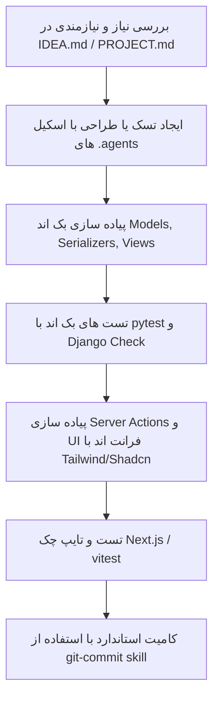

# 🔄 دستورالعمل‌ها و جریان‌های کاری توسعه (WORKFLOW.md)

این سند فرآیندها، استانداردهای توسعه، مدیریت تسک‌ها و همکاری ایجنت‌های هوش مصنوعی را برای پروژه کلینیک آنلاین مشخص می‌کند.

---

## ۱. چرخه توسعه ویژگی‌های جدید (Feature Development Lifecycle)



---

## ۲. راهنمای ایجنت‌های هوش مصنوعی (.agents Workflow)

### 🤖 ۱. راهبری توسط ایجنت ارشد (Parallel Agent Leader)
برای فیچرهای پیچیده (مانند ویزیت آنلاین یا درگاه‌های تکمیلی):
1. تسک را به مراحل کامپوننت‌محور و ایزوله در پوشه `tasks/` بشکنید.
2. هر زیرمجموعه را به Sub-Agent تخصصی (مثلاً `django-expert` برای دیتامدل‌ها یا `shadcn-persian` برای UI) واگذار کنید.
3. در انتها تست نهایی یکپارچه‌سازی (Integration Verification) را انجام دهید.

### 🛡️ ۲. اصول پیاده‌سازی بک‌اند (Django & DRF Guidelines)
- همیشه از Type Hinting و Docstring کامل استفاده کنید.
- منطق تجاری سنگین باید در لایه Services یا Custom Managers قرار گیرد، نه داخل Viewها.
- کوئری‌های دیتابیس باید بهینه‌سازی شوند (`select_related` برای FK و `prefetch_related` برای ManyToMany).
- متغیرهای حساس را فقط از طریق `decouple.config` با مقدار `default` مناسب لود کنید.

### 🎨 ۳. اصول پیاده‌سازی فرانت‌اند (Next.js & RTL UI)
- ساختار کامپوننت‌ها باید به صورت پیش‌فرض کاملاً راست‌چین (RTL First) و هماهنگ با فونت فارسی باشد.
- برای تعامل با API، همیشه از Server Actions در پوشه `src/actions/` استفاده کنید.
- اعتبارسنجی ورودی‌ها در کلاینت و سرور باید با اسکیماهای Zod انجام شود.
- متغیرهای عمومی با پیشوند `NEXT_PUBLIC_` و سایر متغیرهای سروری در `src/config/env.config.ts` مدیریت شوند.

---

## ۳. دستورات پرکاربرد (Commands Cheatsheet)

### 🐍 بک‌اند:
```bash
# اجرای سرور توسعه جنگو
python manage.py runserver 8000

# اعمال مایگریشن‌ها
python manage.py makemigrations
python manage.py migrate

# اجرای بررسی صحت سیستم
python manage.py check

# اجرای ورکر Celery برای تسک‌های پس‌زمینه
celery -A online_clinic_backend worker -l info --pool=solo
```

### ⚡ فرانت‌اند:
```bash
# اجرای سرور توسعه Next.js
npm run dev

# ساخت و بررسی نسخه پروداکشن
npm run build

# اجرای تست‌های واحد فرانت‌اند
npx vitest run

# بررسی خطاهای تایپ‌اسکریپت
npx tsc --noEmit
```
